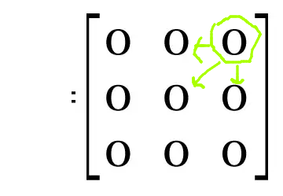

<h1>The_Walking_in_a_Matrix</h1>

<h2>THE PROBLEM</h2>

This problem is about how walking in a matrix, where the Jack can init in
any position of the matrix and he will walking per it for the houses with 
the bigger element, and for that it´s necessary to make different checks 
in the positions of the matrix, checks in right or down or in the diagon
ally or back one position, and after go to the position that have the bi
gger element between the five options, this is a greedy algorithm.

<h3>Greedy Algorithm</h3>

This method check all options that you have in the moment and select the 
best options and it´s not important if this is good or bad in the future, 
in other words the greedy method make the best select in each stage with 
base in the informations provided in that stage. He can used when you 
need check the best possible the each interaction. Here the method is 
used for select the bigger number between five option in each stage and
sum the selected element and recorde in the variable Bigger. 

<h3>The walking in a Matrix</h3>

This project uses walking in a matrix to arrive at the last position of 
any matrix and sum the elements per where pass, because is necessary to sum all 
bigger numbers and show the result at the finish of the walking. this implementation
occurred whit a "while" that has like stop a variable that does not change while
Jack didn't arrive at the last position of the matrix, and when "while" is 
executed into five beginner checks, construed with five ternary operators,
it´s another way of using "if" and "else", but, what happened when into this a
function? what happened is the access to the addresses in the houses around the current
house and check if the variable Bigger that in start execution the 
"SearchingTheBiggerElement", function like zero and another stage that finishes
the check this variable return for zero and recalculate again, because in the
next check if the last result can make a difference in the search the bigger 
number, because the variable Bigger will have a bigger value of the last
case can this change the real result of the current case.

<h2>ONE EXAMPLE OF THE COMPILATION AND EXPLANATIONS ABOUT PROJECT</h2>

Here you will see the program and your execution, that is divide in three visual
stages, they are:

OBS: If you wanna see this stages in pratice, you skip for part of the readme that 
tell about the compilation this project and understand the compilation way, and after
you need return for here.

<ul>
  <li>Extract of informations and Filling in the data file</li>
  <li>Information Processing</li>
  <li>Results</li>
</ul>

<h3>Extract of informations and Filling in the data file</h3>

Before the extract happened one insertion, where the first comand is open and
write the file data that not have the matrix for walking, in this moment
the function "SetMatrixSize" and function "SaveMatrix" are called and insert 
in the file the size and the elements of the matrix, the location where this
function be is the lines 26 at 32.

Insert elements in the matrix:

This insertion happend with use the function "GeneretaMatrixValues", this 
function filling in the matrix of the struct Matrix with random values with
the used the function "rand()" of the C programming lenguage with values between
0-99, this interval was selected because it´s not good have the big values for 
sum.

The extract of informations is the second thing that is execute and happend 
when you start the program, for this you write make in terminal and after 
you write make run for execute the program, and extraction information will
be collected.

<h3>Information Processing</h3>

Later the compiler open again the data file and read the first matrix recorded 
in this file, and this can seem repetitive and wrong, but no because in the 
moment of recorde matrix in the data file is used just one matrix, and when add
the more of one matrix, and the matrix will be with the last matrix generated
per the program. With the file open the read all matrix and recorde in a vector.
And this happened in the between Rows 34 at 77 in the file "matriz.c".In short in 
this moment happend three things:

<ul>
  <li>Recovery the size of matrix</li>
  <li>Alocation the vector</li>
  <li>Filling in the vector</li>
</ul>

<ul>
  <li>Recovery the size matrix:</li>
</ul>

The recovery of the matrix size occurs through a data file, opened for the reading of 
the first line, and stop reading with a break, because the first line does not fill 
the vector, and fills only the Row and Column variables.

<ul>
  <li>Alocation the vector:</li>
</ul>

The vector is allocated with the use of the variable Row, the matrix of the program
ever is square, so was possible to use the pow function of the library math to have
the total number of elements, and use the malloc function to accomplish the 
allocation.

<ul>
  <li>Filling in the vector:</li>
</ul>

"fscanf" was used to fill the vector, and after that the vector is used to fill the matrix when requested by the user.

After this the compiler into the "while" where the filling in the matrix and the walking happened. 
When the compiler is in the "while" where the change and walking happen you will
see the question: "You want to start walking in the matrix in the row?" and the
question: "You want to initiate the walking in the matrix in the column?".This is happen
after filling in the matrix, where a counter will forward for access the houses
of vector and attributions to the matrix, what happened is that at each stage this 
the function is open the counter where start other matrices, and this way ever
access this function the matrix will fill in with new numbers, and this function be
in between lines 55 at 67in the file "matriz.c".

Later the two questions for start, the function "SearchingTheBiggerElement" is called
and start the walking per matrix. In this moment we have three procedure happening:

<ul>
  <li>Receiving parameters</li>
  <li>Analysis the neighbors</li>
  <li>Change the position of the Jack and Sum of selected elements</li>
</ul>

<ul>
  <li>Receiving parameters:</li>
</ul>

The parameters are: one variable of the type Matrix struct, start row and start
column, and the last parameter is a variable that record the sum of the big
numbers along the way of the Jack. Watch in the file "matriz.c" in the lines 85 at 99
inside the function "SearchingTheBiggerElement" that four variables was added in
the function and two variables received the start row and start colunm, because
is necessary change the variable in each iteration, and the two first operation
are performed because for the start position have means in the finish procedure

<ul>
  <li>Analysis the neighbors:</li>
</ul>

Later the compiler into in the "while" that start the search in the matrix, you can see
in the lines 105 at 109, whatch that first is necessary to analyze if is possible performed
the check, because if the position not exist, an error will, that IDE will notify like 
"segmentation fault", if the check will true, start a checking the values of the neighbors
positions in around the current position, they are: main diagonal of down, second diagonal
of down, the right, the left and the down. when meet the Bigger between five options, it´s
save in the variable Bigger, and whit this go to second stage of checks where the decision
of walking is made, but if the options will is equals in all directions?, In this case the
Jack will walking for the position that will possible walking for she.

You can see that in this situation all options are equais, and the algorithm decision go to 
the positon that can first possible walking per she right, will depend of situation, per 
example in this case analysis the code the Jack walking for second diagonal of down, because
in the moment that search in the neighbors what is the Bigger element found the last check
is in the second diagonal of down, the Bigger is equal in all derections soon the last check
will executed.

<ul>
  <li>Change the position of the Jack and Sum of selected elements:</li>
</ul>

After meet the Bigger element in the current stage, the Jack walking the position where 
this element be, that occurs in the lines 112 at 116 of the file "matriz.c", Watch in 
this file that change and sum the value that have the current position after the Jack
change your position, look this:

What happend if this check will true, the Row is sum with one, and the sum variable is added
of itself the before value, and this way the Jack walking per the matrix.

<h3>Results</h3>

For you see the way like this algorithm works, here have a example of input and output, look:

Input(data file and two start questions):

Output:

How expected the Jack walking per positon of the matrix that had the bigger
elements and sumed this components, and with this Jack arrive the last element
of the matrix that was the goal.

<h2>HOW TO DO FOR COMPILE THE CODE THIS PROJECT</h2>

This project use the Make file for compiler all files that have function
for operation in the all executions for walking in the matrix and sum the
elements, these are the pictures for you to understand how compiler and
know how this project works that are divide in three parts,look:

<ul>
  <li>Compilation</li>
  <li>Execution</li>
  <li>Clean executable</li>
</ul>

The first comand compile the code and used the comand with "gcc", this is 
happend because the Make file is just a list of comands that required when 
their comands are write in the terminal, this means that you can open the
make file catch the comand wrote and put in terminal and click enter that
will happend the compile and execute and remove the executable. Each comand
will do a action,the make compiler, and make run execute the executable that
was generated when the comand make wrote in terminal, and the make clean
clean the executable the files of the project, they are:

When write the make comand:

Before the comand make:

After the comand make:

